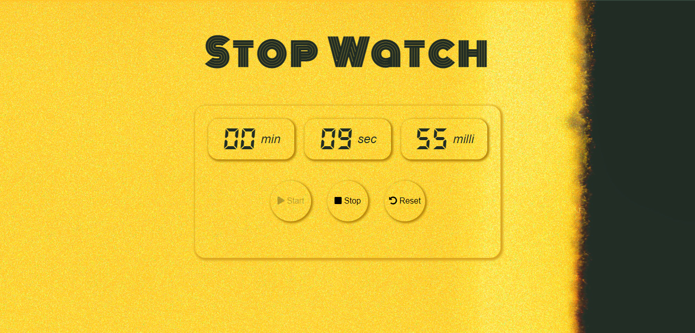
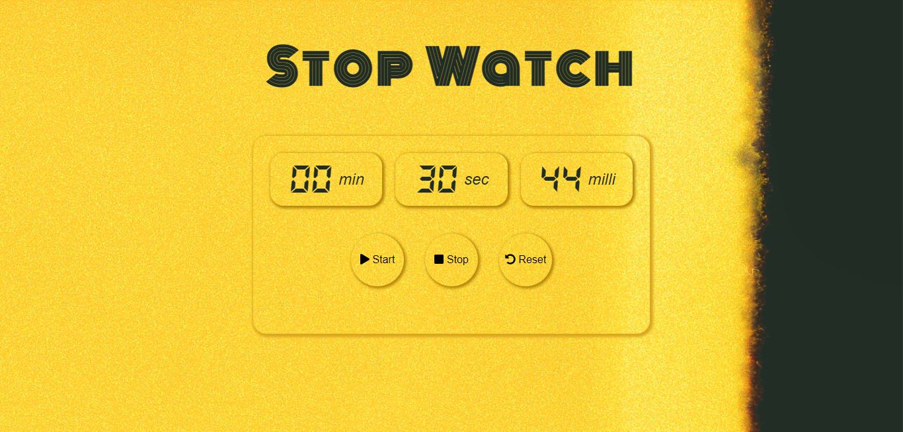
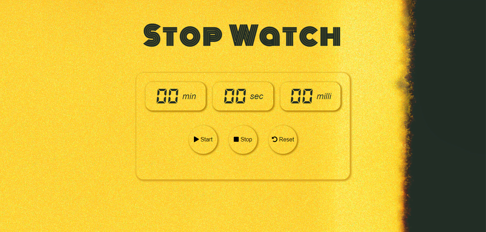
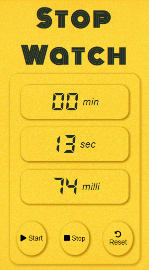

# stop-watch
A simple stop watch made with HTML, CSS and Javascript. The project is made as a part of skill test.
### Live Demo: (https://prashwarmishra.github.io/stop-watch/)
### Screenshots:
- When start button is clicked, the stopwatch starts and start button gets disabled.

- When stop button is clicked, stopwatch stops and the start button is live again.

- Clicking on the reset button will reset the stopwatch back to it's initial state.

- The UI is also responsive for all screen-sizes.

